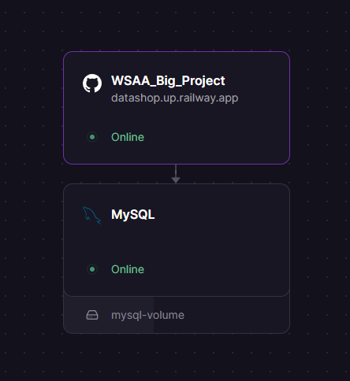

# DataShop - Web Services and Applications Big Project

## Project Overview

DataShop is a modern, responsive web application designed for seamless inventory management and data-driven shopping.
The project features a dual-role interface:

- Customer View: A clean, searchable marketplace for browsing and purchasing products.

- Administrator Dashboard: A powerful management suite for tracking stock, viewing order history, and monitoring
  real-time financial valuation.

Key features include:

- Dynamic Role Switching: Toggle between Customer and Admin modes instantly.

- Live Currency Conversion: Integrated with a global CDN to fetch live EUR-USD exchange rates for inventory valuation.

- Real-Time Search & Filters: Advanced filtering by category and name for both customers and administrators. Sorting
  options for price and alphabetical order.

- Automated Analytics: Visualizes total inventory value and order volume.

## Technologies Used

- Frontend: HTML5, CSS3, JavaScript (ES6+).

- Styling: Bootstrap 5, FontAwesome 6.

- Backend: Python (Flask)

- Data Format: JSON-based REST API endpoints.

- External Integration: Currency API (via Cloudflare CDN).

## API Endpoints

The application follows a RESTful architecture. You can access the raw data by visiting the following routes:

- `/products`: Get a list of all products in JSON format.
- `/orders`: Get a list of all orders in JSON format.
- `/inventory`: Get the current inventory status in JSON format.
- `/order_items`: Get a list of all order items in JSON format.
- `/customers`: Get a list of all customers in JSON format.

When visiting these routes directly, the browser will display raw JSON data.

## Online Deployment:

The application is hosted on https://railway.com and auto-deployment is configured upon every
git push.

### Deployment Structure:

#### MySQL database:

Railway hosted MySQL database with connection details stored in environment variables.

#### Flask Backend:

- The Flask backend is responsible for handling API requests, processing data, and serving the frontend.
- It is configured to run on the Railway platform, which provides a seamless deployment experience.

The application can be accessed at https://datashop.up.railway.app/

