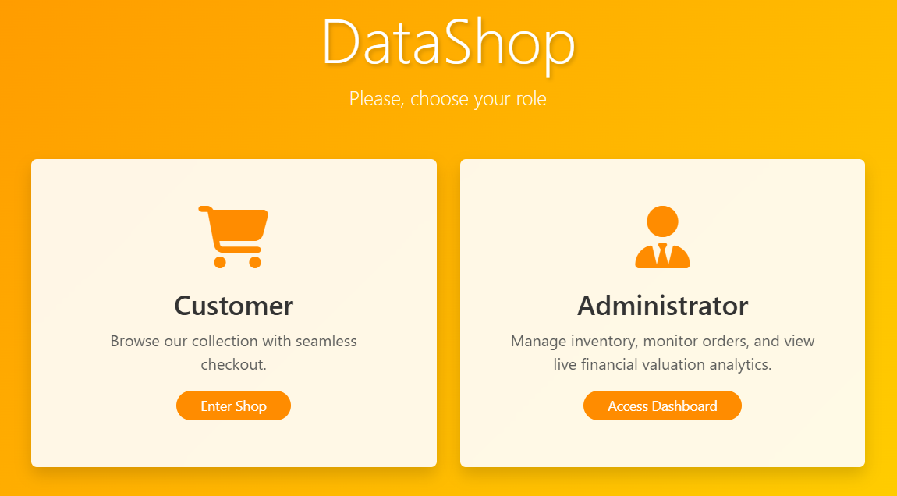

# DataShop - Web Services and Applications Big Project

## Project Overview

DataShop is a modern, responsive web application designed for seamless inventory management and data-driven shopping.
The project features a dual-role interface:

- Customer View: A clean, searchable marketplace for browsing and purchasing products.

- Administrator Dashboard: A powerful management suite for tracking stock, viewing order history, and monitoring
  real-time financial valuation.

Key features include:

- Dynamic Role Switching: Toggle between Customer and Admin modes instantly.

- Live Currency Conversion: Integrated with a global CDN to fetch live EUR-USD exchange rates for inventory valuation.

- Real-Time Search & Filters: Advanced filtering by category and name for both customers and administrators. Sorting
  options for price and alphabetical order.

- Automated Analytics: Visualizes total inventory value and order volume.

<p align="center">
  
</p>

## Directory Map

```
.
├── db/                   # Database scripts
│   └── init.sql          # SQL script to initialize tables/schema
├── static/               # Client-side assets served directly
│   ├── app.js            # Frontend logic and API calls
│   └── style.css         # Custom styling and layouts
├── templates/            # HTML templates processed by Flask
│   └── index.html        # Main dashboard interface
├── .env.example          # Template for environment variables (DB credentials)
├── .gitignore            # Files to exclude from Git
├── Procfile              # Tells Railway how to run the app
├── config.py             # Credentials (stored in environment variables) for DB connections
├── customerDAO.py        # Data Access Object for customer table
├── inventoryDAO.py       # Data Access Object for inventory table
├── order_itemsDAO.py     # Data Access Object for cart items
├── ordersDAO.py          # Data Access Object for order management
├── requirements.txt      # List of Python dependencies
└── server.py             # Main Flask entry point and API routes
```

## Setup Instructions

1. Clone the repository:

   ```bash
   git clone https://github.com/AnnaLozenko/WSAA_Big_Project.git
   ```
2. Install dependencies:

   ```bash
   pip install -r requirements.txt
   ```
3. Set up environment variables:  
   Create a `.env` file in the root directory and add your database credentials:

   ```
   DB_HOST=your_db_host
   DB_USER=your_db_user
   DB_PASSWORD=your_db_password
   DB_NAME=your_db_name
   ```
4. Initialize the database:  
   Run the script in `db/init.sql` in MySQL Workbench to create the necessary tables and schema.

5. Start the Flask server:

   ```bash
    python server.py
    ```
6. Access the application:  
   Open your web browser and navigate to `http://127.0.0.1:5000` to view the application

## Technologies Used

- Frontend: HTML5, CSS3, JavaScript (ES6+).

- Styling: Bootstrap 5, FontAwesome 6.

- Backend: Python 3.10+

- Framework: Flask for API development and server-side rendering.

- Data Format: JSON-based REST API endpoints.

- External Integration: Currency API (via Cloudflare CDN).

- Database: MySQL (hosted on Railway).

- Deployment: Railway (https://railway.com) for both backend and database hosting.

## AI Use

Gemini AI assistance for frontend design and development. The following prompts for styling were used:

    - "Design a modern, responsive web application interface for an inventory management system. The design should be
      clean and user-friendly, with a focus on usability and aesthetics. Use a color scheme that is visually appealing
      and easy on the eyes. The interface should include a dashboard for administrators to manage inventory and view
      analytics, as well as a marketplace for customers to browse and purchase products. Incorporate elements such as
      cards, tables, and charts to display information effectively. Ensure that the design is mobile-responsive and
      works well on various screen sizes."
    - "How can I use Bootstrap classes to make my 'Add New Item' button look professional and align it to the right of
      the page header?"
    - "Help me create a CSS hover effect for my table rows so they highlight when a user mouses over them."
    - "How can I use FontAwesome icons to enhance the visual appeal of my product cards in the marketplace section of my web
      application?"

While Gemini provided the initial CSS structures and Bootstrap layouts, I manually integrated these into the Flask
template logic and refined the styles to match the data requirements of the Inventory and Order DAOs.

## API Endpoints

The application follows a RESTful architecture, providing predictable JSON responses. This allows the frontend to remain
decoupled from the data layer, facilitating easier updates.  
The raw data can be accessed by visiting the following routes:

- `/orders`: Get a list of all orders in JSON format.
- `/inventory`: Get the current inventory status in JSON format.
- `/order_items`: Get a list of all order items in JSON format.
- `/customers`: Get a list of all customers in JSON format.

When visiting these routes directly, the browser will display raw JSON data.

## External API Integration

The application integrates with a currency API to fetch live EUR-USD exchange rates using the
`latest.currency-api.pages.dev` endpoint via Cloudflare CDN. This allows for real-time valuation
of inventory in both currencies, providing users with up-to-date financial insights. The prices are dynamically updated
on the frontend. The frontend fetches current exchange rates (USD/EUR) to allow users to view inventory prices in their
preferred currency. If the API is unreachable, the application automatically falls back to a hardcoded baseline rate (
1.08 USD/EUR) to ensure the UI remains functional.

## Online Deployment

The application is hosted on https://railway.com and auto-deployment is configured upon every
git push. This platform allows for easy management of both the Flask backend and the MySQL database, ensuring that the
application is always up-to-date and accessible to users.
Database credentials are stored in environment variables for security, and the Flask backend is set up to connect to the
MySQL database seamlessly.

### Deployment Structure

#### MySQL database

Railway hosted MySQL database with connection details stored in environment variables.

#### Flask Backend

- The Flask backend is responsible for handling API requests, processing data, and serving the frontend.
- It is configured to run on the Railway platform, which provides a seamless deployment experience.

The application can be accessed at https://datashop.up.railway.app/


